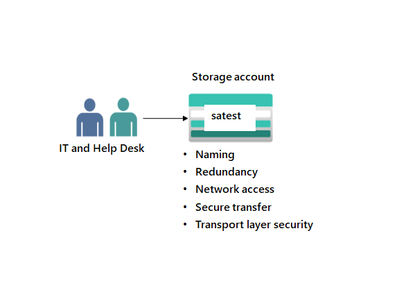

---
lab:
  title: "Exercice\_01\_: Fournir un stockage pour les tests et la formation du service informatique"
  module: Guided Project - Azure Files and Azure Blobs
---

Le service informatique doit prototyper différents scénarios de stockage et former le nouveau personnel. Le contenu n’est pas assez important pour être sauvegardé et n’a pas besoin d’être restauré si les données sont écrasées ou supprimées. Une configuration simple pouvant être facilement modifiée est souhaitée.

## Diagramme de l'architecture

## Tâches d'apprentissage
- Créez un compte de stockage. 
- Configurer les paramètres de base pour la sécurité et le réseau. 

## Instructions de l’exercice

## Créer un groupe de ressources et un compte de stockage

1. Créez et déployez un groupe de ressources qui contiendra toutes les ressources de votre projet. En savoir plus sur les [groupes de ressources](https://learn.microsoft.com/azure/azure-resource-manager/management/manage-resource-groups-portal).
    - Dans le Portail Azure, recherchez et sélectionnez `Resource groups`.
    - Sélectionnez **+ Créer**.
    - Donnez un **nom** à votre groupe de ressources. Par exemple : `storagerg`.
    - Sélectionnez une **région**. Utilisez cette région tout au long du projet. 
    - Sélectionnez **Vérifier et créer** pour valider le groupe de ressources.
    - Sélectionnez **Créer** pour déployer le groupe de ressources.

1. Créez et déployez un compte de stockage pour prendre en charge les tests et la formation. En savoir plus sur les [types de comptes de stockage](https://learn.microsoft.com/azure/storage/common/storage-account-overview#types-of-storage-accounts).
    - Dans le Portail Azure, recherchez et sélectionnez `Storage accounts`. 
    - Sélectionnez **+ Créer**.
    - Sous l’onglet **Informations de base**, sélectionnez votre **Groupe de ressources**.
    - Indiquez un **Nom de compte de stockage**. Le nom du compte de stockage doit être unique dans Azure. 
    - Définissez les **Performances** sur **Standard**. 
    - Sélectionnez **Vérifier**, puis **Créer**. 
    - Attendez que le compte de stockage soit déployé, puis sélectionnez **Accéder à la ressource**.  

## Configurez des paramètres simples dans le compte de stockage.

1. Les données de ce compte de stockage n’ont pas besoin d’un haut niveau de disponibilité ou de durabilité. Une solution de stockage à moindre coût est souhaitée. En savoir plus sur la [redondance des comptes de stockage](https://learn.microsoft.com/azure/storage/common/storage-redundancy#locally-redundant-storage).
    - Dans votre compte de stockage, dans la section **Gestion des données**, sélectionnez le panneau **Redondance**.
    - Sélectionnez **Stockage localement redondant (LRS)** dans la liste déroulante **Redondance**. 
    - Veillez à **Enregistrer** vos modifications. 
    - Actualisez la page et notez que le contenu n’existe que dans l’emplacement principal. 

1. Le compte de stockage doit uniquement accepter les demandes provenant de connexions sécurisées. En savoir plus sur la [nécessité d’un transfert sécurisé à partir de connexions sécurisées](https://learn.microsoft.com/azure/storage/common/storage-require-secure-transfer).
    - Dans la section **Paramètres**, sélectionnez le panneau **Configuration**.
    - Vérifiez que l’option **Transfert sécurisé requis** est **activée**. 

1. Les développeurs souhaitent que le compte de stockage utilise au moins la version 1.2 de TLS. En savoir plus sur [TLS (Transport Layer Security)](https://learn.microsoft.com//azure/storage/common/transport-layer-security-configure-minimum-version?tabs=portal).
    - Dans la section **Paramètres**, sélectionnez le panneau **Configuration**.
    - Vérifiez que la **Version minimale de TLS** est définie sur **Version 1.2**.  

1. Tant que le stockage n’est pas utilisé, désactivez les demandes d’accès au compte de stockage. En savoir plus sur la [désactivation des clés partagées](https://learn.microsoft.com/azure/storage/common/shared-key-authorization-prevent?tabs=portal#disable-shared-key-authorization).
    - Dans la section **Paramètres**, sélectionnez le panneau **Configuration**.
    - Vérifiez que l’option **Autoriser l’accès aux clés du compte de stockage** est **désactivée**.
    - Veillez à **Enregistrer** vos modifications. 

1. Vérifiez que le compte de stockage autorise l’accès public à partir de tous les réseaux.  
    - Dans la section **Sécurité + mise en réseau**, sélectionnez le panneau **Mise en réseau**.
    - Vérifiez que l’option **Accès réseau public** est définie sur **Activé à partir de tous les réseaux**.
    - Veillez à **Enregistrer** vos modifications. 

>**Remarque** : pour des exercices supplémentaires, suivez le module [Créer un compte de stockage Azure](https://learn.microsoft.com/training/modules/create-azure-storage-account/). Le module propose un bac à sable qui vous permet de vous familiariser avec la création d’un compte de stockage.

## Développer votre apprentissage avec Copilot

Copilot peut vous aider dans votre parcours d’apprentissage. Copilot peut présenter des informations techniques de base, des étapes générales, les avantages et les inconvénients, de l’aide à la résolution des problèmes, des cas d’utilisation, des exemples de codage, etc. Pour accéder à Copilot, ouvrez un navigateur Edge et choisissez Copilot (en haut à droite). Prenez quelques minutes pour essayer ces invites.
+ Qu’est-ce qu’un compte de stockage Azure ? Quels sont les types de comptes de stockage Azure disponibles ?
+ Créez un tableau comparant les niveaux de performances du stockage Azure. Mettez en avant ses principales fonctionnalités et cas d’usage. 
+ Quelles sont les options de redondance de stockage Azure disponibles ? Quand utiliser chaque option ?

## En savoir plus grâce à l’apprentissage auto-rythmé

+ [Décrivez les services de stockage Azure](https://learn.microsoft.com/training/modules/describe-azure-storage-services/). Dans ce module, vous allez comparer les services de stockage Azure, décrivre les niveaux de stockage et les options de redondance.
+ [Créer un compte de stockage Azure](https://learn.microsoft.com/training/modules/create-azure-storage-account/) Dans ce module, vous allez créer et configurer un compte de stockage. 

## Points clés

Félicitations, vous avez terminé le labo. Voici les principaux points à retenir de ce labo. 
+ Un compte de stockage Azure est un conteneur qui comprend tous vos objets de données de stockage Azure, y compris les blobs, les fichiers, les files d’attente et les tables.
+ Le stockage Azure offre plusieurs types de comptes de stockage, Standard et Premium. Chaque type prend en charge différentes fonctionnalités et a son propre modèle tarifaire.
+ Le stockage Azure stocke toujours plusieurs copies de vos données afin de les protéger contre les événements planifiés et non planifiés.
+ Les modèles de redondance peuvent répliquer des données dans les régions primaires et secondaires. 
