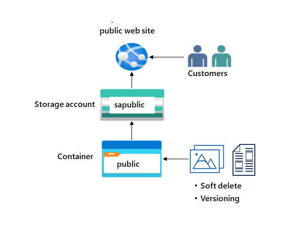

---
lab:
  title: "Exercice\_02a\_: Fournir du stockage pour le site web public"
  module: Guided Project - Azure Files and Azure Blobs
---
Le site web de l’entreprise fournit des images de produits, des vidéos, des documents marketing et des témoignages de réussite de clients. Les clients sont répartis dans le monde entier et la demande augmente rapidement. Le contenu est stratégique et nécessite des temps de chargement à faible latence. Il est important de faire le suivi des versions des documents et de restaurer rapidement les documents s’ils sont supprimés.

## Diagramme de l'architecture

## Tâches d'apprentissage
- Créez un compte de stockage à haute disponibilité.
- Assurez-vous que le compte de stockage dispose d’un accès public anonyme.
- Créez un conteneur de stockage d’objets blob pour les documents du site web.
- Activez la suppression réversible afin que les fichiers puissent être facilement restaurés.
- Activer le contrôle de version des objets blob. 

## Instructions de l’exercice

## Créez un compte de stockage à haute disponibilité.

1. Créez un compte de stockage pour prendre en charge le site web public.

    - Dans le portail, recherchez et sélectionnez `Storage accounts`.  
    - Sélectionnez **+ Créer**. 
    - Pour **Groupe de ressources**, sélectionnez **Nouveau**. Donnez un **nom** à votre groupe de ressources et sélectionnez **OK**. 
    - Définissez le **Nom du compte de stockage** sur `publicwebsite`. Assurez-vous que le nom du compte de stockage est unique en ajoutant un identificateur.
    - Utilisez les valeurs par défaut pour les autres paramètres. 
    - Sélectionnez **Vérifier**, puis **Créer**.
    - Attendez que le compte de stockage soit déployé, puis sélectionnez **Accéder à la ressource**.
         
1. Ce stockage nécessite une haute disponibilité en cas de panne régionale. De plus, activez l’accès en lecture à la région secondaire. En savoir plus sur la [redondance des comptes de stockage](https://learn.microsoft.com/azure/storage/common/storage-redundancy#geo-redundant-storage).

    - Dans le compte de stockage, dans la section **Gestion des données**, sélectionnez le panneau **Redondance**. 
    - Vérifiez que l’option **Stockage géoredondant avec accès en lecture** est sélectionnée.
    - Passez en revue les informations d’emplacement principal et secondaire. 

1. Les informations du site web public doivent être accessibles sans que les clients aient à se connecter.
    - Dans le compte de stockage, dans la section **Paramètres**, sélectionnez le panneau **Configuration**.
    - Vérifiez que le paramètre **Autoriser l’accès anonyme aux objets blob** est **Activé**.
    - Veillez à **Enregistrer** vos modifications. 
  
   
## Créer un conteneur de stockage d’objets blob avec un accès anonyme en lecture

1. Le site web public contient divers documents et images. Créez un conteneur de stockage d’objets blob pour le contenu. En savoir plus sur les [conteneurs de stockage](https://learn.microsoft.com/azure/storage/blobs/storage-blobs-introduction#containers).
    - Dans votre compte de stockage, dans la section **Stockage des données**, sélectionnez le panneau **Conteneurs**. 
    - Sélectionnez **+ Conteneur**. 
    - Vérifiez que le **Nom** du conteneur est `public`. 
    - Sélectionnez **Créer**. 
    
1. Les clients doivent pouvoir voir les images sans être authentifiés. Configurez l’accès en lecture anonyme pour les objets blob du conteneur public.  En savoir plus sur la [configuration de l’accès public anonyme](https://learn.microsoft.com/azure/storage/blobs/anonymous-read-access-configure?tabs=portal).
    - Sélectionnez votre conteneur **public**. 
    - Dans le panneau **Vue d’ensemble**, sélectionnez **Modifier le niveau d’accès**. 
    - Vérifiez que le **Niveau d’accès public** est défini sur **Objet blob (accès en lecture anonyme pour les objets blob uniquement)**.
    - Cliquez sur **OK**. 

## Entraînez-vous à charger des fichiers et à tester l’accès.

1. Pour effectuer des tests, chargez un fichier dans le conteneur **public**. Le type de fichier n’a pas d’importance. Choisissez par exemple un petit fichier image ou texte.  
    - Assurez-vous de bien voir votre conteneur. 
    - Sélectionnez **Charger**. 
    - **Parcourez les fichiers** et sélectionnez-en un. Accédez au fichier de votre choix. 
    - Sélectionnez **Charger**.
    - Fermez la fenêtre de chargement, **Actualisez** la page et vérifiez que votre fichier a été chargé. 

1. Déterminez l’URL de votre fichier chargé. Ouvrez un navigateur et testez l’URL. 
    - Sélectionnez votre fichier chargé.
    - Sous l’onglet **Vue d’ensemble**, copiez l’**URL**.
    - Collez l’URL dans un nouvel onglet de navigateur.
    - Si vous avez chargé un fichier image, il s’affiche dans le navigateur. Les autres types de fichiers devraient être téléchargés. 

## Configurer la suppression réversible

1. Il est important que les documents du site web puissent être restaurés s’ils sont supprimés. Configurez la suppression réversible d’objets blob pendant 21 jours. En savoir plus sur la [suppression réversible des objets blob](https://learn.microsoft.com/azure/storage/blobs/soft-delete-container-enable?tabs=azure-portal).
    - Accédez au panneau **Vue d’ensemble** du **compte de stockage**.
    - Sur la page **Propriétés**, recherchez la section **service BLOB**.
    - Sélectionnez le paramètre **Suppression réversible d’objets blob**.
    - Vérifiez que la case **Activer la suppression réversible des objets blob** est **cochée**.
    - Définissez le paramètre **Conserver les objets blob supprimés pendant (jours)** sur **21**.
    - Notez que vous pouvez également **Activer la suppression réversible pour les conteneurs**. 
    - N’oubliez pas de cliquer sur **Enregistrer** pour enregistrer vos modifications. 

1. Si quelque chose est supprimé, vous devez vous entraîner à utiliser la suppression réversible pour restaurer les fichiers.
    - Accédez au conteneur où vous avez chargé un fichier.
    - Sélectionnez le fichier que vous avez chargé, puis sélectionnez **Charger**.
    - Sélectionnez **OK** pour confirmer la suppression du fichier.  
    - Dans la page **Vue d’ensemble** du conteneur, basculez le curseur **Afficher les objets blob supprimés**. Ce bouton bascule est à droite de la zone de recherche. 
    - Sélectionnez votre fichier supprimé et utilisez les points de suspension tout à droite pour **Annuler la suppression** du fichier. 
    - Actualisez le conteneur et confirmez que le fichier a été restauré.     

## Configurer le versioning des objets blob
1. Il est important de faire le suivi des différentes versions des documents relatifs aux produits du site web. En savoir plus sur le [contrôle de version des objets blob](https://learn.microsoft.com/azure/storage/blobs/versioning-enable?tabs=portal).
    - Accédez au panneau **Vue d’ensemble** du **compte de stockage**.
    - Dans la section **Propriétés**, recherchez la section **service BLOB**.
    - Sélectionnez le paramètre **Contrôle de version**.
    - Vérifiez que la case **Activer le contrôle de version pour les objets blob** est cochée.
    - Notez que vous avez la possibilité de **conserver toutes les versions** ou de **supprimer les versions ultérieures**. 
    - N’oubliez pas de cliquer sur **Enregistrer** pour enregistrer vos modifications. 

1. Si vous en avez le temps, essayez de restaurer les versions précédentes des objets blob.
   - **Chargez** une autre version de votre fichier conteneur. Votre fichier existant sera alors remplacé. 
   - La version précédente de votre fichier est répertoriée sur la page **Afficher les objets blob supprimés**. 
    
## Développer votre apprentissage avec Copilot

Copilot peut vous aider dans votre parcours d’apprentissage. Copilot peut présenter des informations techniques de base, des étapes générales, les avantages et les inconvénients, de l’aide à la résolution des problèmes, des cas d’utilisation, des exemples de codage, etc. Pour accéder à Copilot, ouvrez un navigateur Edge et choisissez Copilot (en haut à droite). Prenez quelques minutes pour essayer ces invites.
+ Qu’est-ce que le stockage Blob Azure et quand doit-il être utilisé ?
+ Comparez les différents modèles de redondance de stockage Azure, en mettant en évidence leurs principales fonctionnalités et cas d’usage.
+ Quels sont les niveaux de stockage Azure et comment ces niveaux permettent-ils d’économiser de l’argent ?

## En savoir plus grâce à l’apprentissage auto-rythmé

+ [Explorez le stockage Blob Azure](https://learn.microsoft.com/training/modules/explore-azure-blob-storage/). Dans ce module, vous allez découvrir les principales fonctions et fonctionnalités du stockage Blob Azure.

## Points clés

Félicitations, vous avez terminé le labo. Voici les principaux points à retenir de ce labo. 
+ Stockage Blob Azure est optimisé pour stocker des quantités massives de données non structurées. Les données non structurées sont des données qui n’obéissent pas à un modèle ou une définition de données en particulier, comme des données texte ou binaires.
+ La suppression réversible d’objets blob protège un objet blob, un instantané ou une version contre les suppressions ou les remplacements accidentels en conservant les données supprimées dans le système pendant un laps de temps spécifié. 
+ Le contrôle de version des blobs conserve les versions précédentes d’un blob. Lorsque le contrôle de version des blobs est activé, vous pouvez restaurer une version antérieure d’un objet blob pour récupérer vos données si celles-ci ont été modifiées ou supprimées.
+ Quand un conteneur est configuré pour un accès anonyme, n’importe quel client peut lire les données de ce conteneur.
