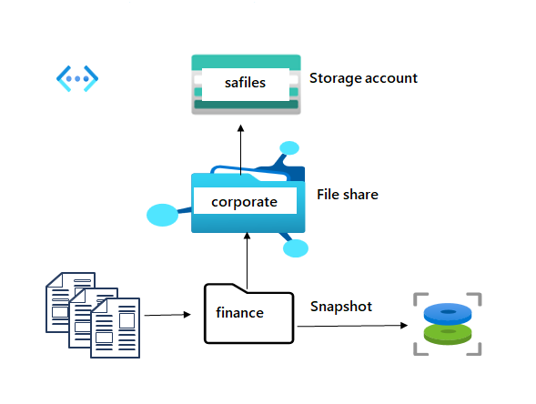

---
lab:
  title: "Exercice\_03\_: Fournir du stockage de fichiers partagé pour les bureaux de l’entreprise"
  module: Guided Project - Azure Files and Azure Blobs
---

L’entreprise est géographiquement dispersée et possède des bureaux à différents endroits.  Ces bureaux ont besoin d’un moyen de partager des fichiers et de diffuser des informations. Par exemple, le service financier doit confirmer les informations relatives aux coûts à des fins d’audit et de conformité. Ces fichiers partagés doivent être faciles d’accès et leur chargement doit être rapide. Certains contenus ne doivent être accessibles qu’à partir de réseaux virtuels d’entreprise sélectionnés.

## Diagramme de l'architecture

## Tâches d'apprentissage
- Créez un compte de stockage dédié au partage de fichiers. 
- Configurer un partage de fichiers et un répertoire.  
- Configurer des instantanés et s’entraîner à restaurer des fichiers. 
- Restreindre l’accès à un réseau virtuel et à un sous-réseau spécifiques. 

## Instructions de l’exercice

>**Remarque** : pour suivre ce labo, vous devez disposer d’un [abonnement Azure](https://azure.microsoft.com/free/).

## Créez et configurez un compte de stockage pour Azure Files. 

1. Créez un compte de stockage pour les fichiers partagés du service des finances.  En savoir plus sur les comptes de stockage pour les [déploiements Azure Files](https://learn.microsoft.com/azure/storage/files/storage-files-planning#management-concepts).

    - Dans le portail, recherchez et sélectionnez `Storage accounts`.
    - Sélectionnez **+ Créer**.
    - Pour **Groupe de ressources**, sélectionnez **Créer**. Donnez un **nom** à votre groupe de ressources et sélectionnez **OK** pour enregistrer vos modifications. 
    - Indiquez un **Nom de compte de stockage**. Le nom doit respecter les exigences de nommage. 
    - Définissez le **Niveau de performance** sur **Premium**.
    - Définissez le **Type de compte Premium** sur **Partages de fichiers**.
    - Définissez la **Redondance** sur **Stockage redondant interzone**.
    - Sélectionnez **Vérifier**, puis **Créer** pour créer le compte de stockage.
    - Attendez que la ressource soit déployée.
    - Sélectionnez **Accéder à la ressource**. 

## Créez et configurez un partage de fichiers avec répertoire.

1. Créez un partage de fichiers pour le siège social. En savoir plus sur les [niveaux Azure Files](https://learn.microsoft.com/azure/storage/files/storage-files-planning#storage-tiers).

    - Dans le compte de stockage, dans la section **Stockage des données**, sélectionnez le panneau **Partages de fichiers**. 
    - Sélectionnez **+ Partage de fichiers**, puis entrez un **Nom**.
    - Passez en revue les autres options, mais utilisez les valeurs par défaut.
    - Sélectionnez **Créer**

1. Ajoutez un répertoire au partage de fichiers pour le service des finances. Pour les tests ultérieurs, chargez un fichier. 

    - Sélectionnez votre partage de fichiers, puis **+ Ajouter un répertoire**. 
    - Nommez le nouveau répertoire `finance`.
    - Sélectionnez **Parcourir**, puis sélectionnez le répertoire **Finances**.
    - Notez que vous pouvez **Ajouter un répertoire** pour organiser davantage votre partage de fichiers.
    - **Chargez** un fichier de votre choix. 

## Configurez et testez les instantanés.

1. Comme pour le stockage d’objets blob, vous devez vous protéger contre la suppression accidentelle de fichiers. Vous décidez d’utiliser des instantanés. En savoir plus sur les [instantanés de fichiers](https://learn.microsoft.com/azure/storage/files/storage-snapshots-files).
    
    - Sélectionnez votre partage de fichiers.
    - Dans la section **Opérations**, sélectionnez le panneau **Instantanés**. 
    - Sélectionnez **+Ajouter un instantané**. Le commentaire est facultatif. Cliquez sur **OK**.
    - Sélectionnez votre instantané et vérifiez que votre répertoire de fichiers et le fichier chargé sont inclus.
  
1. Entraînez-vous à utiliser des instantanés pour restaurer un fichier.
    - Retournez à votre **partage de fichiers**.
    - **Accédez** à votre répertoire de fichiers. 
    - Localisez votre fichier chargé, puis dans le panneau **Propriétés** sélectionnez **Supprimer**. Sélectionnez **Oui** pour confirmer la suppression. 
    - Sélectionnez le panneau **Instantanés**, puis sélectionnez votre instantané. 
    - Accédez au fichier à restaurer.
    - Sélectionnez le fichier, puis **Restaurer**.
    - Donnez un **Nom** au fichier restauré. 
    - Vérifiez que votre répertoire de fichiers contient le fichier restauré.  

## Configurez la restriction de l’accès au stockage pour les réseaux virtuels sélectionnés.

1. Les tâches de cette section nécessitent un réseau virtuel avec un sous-réseau. Dans un environnement de production, ces ressources sont déjà créées.
    - Recherchez et sélectionnez **Réseaux virtuels**.
        - Sélectionnez **Créer**. Sélectionnez votre groupe de ressources. et donnez un **nom** au réseau virtuel.
        - Utilisez les valeurs par défaut pour d’autres paramètres, sélectionnez **Vérifier + créer**, puis **Créer**.
        - Attendez que la ressource soit déployée.
        - Sélectionnez **Accéder à la ressource**. 
    - Dans la section **Paramètres**, sélectionnez le panneau **Sous-réseaux**.
        - Sélectionnez le sous-réseau **par défaut**.
        - Dans la section **Points de terminaison de service**, choisissez **Microsoft.Storage** dans la liste déroulante **Services**.
        - N’apportez aucune autre modification.    
        - Veillez à **Enregistrer** vos modifications. 
   
1. Le compte de stockage doit être accessible uniquement à partir du réseau virtuel que vous venez de créer. En savoir plus sur l’utilisation des [points de terminaison de stockage privés](https://learn.microsoft.com/azure/storage/common/storage-private-endpoints).

    - Revenez à votre **compte de stockage de fichiers**. 
    - Dans la section **Sécurité + mise en réseau**, sélectionnez le panneau **Mise en réseau**.
        - Définissez l’**Accès au réseau public** sur **Activé à partir des réseaux virtuels et adresses IP sélectionnés**.
        - Dans la section **Réseaux virtuels**, sélectionnez **Ajouter un réseau virtuel existant**.
        - Sélectionnez votre réseau virtuel et votre sous-réseau, puis sélectionnez **Ajouter**.
        - Veillez à **Enregistrer** vos modifications. 
    - Sélectionnez le **Navigateur de stockage** et accédez à votre partage de fichiers. 
    - Vérifiez le message *n’est pas autorisé à effectuer cette opération*. Vous ne vous connectez pas à partir du réseau virtuel. 

>**Remarque** : pour des exercices supplémentaires, suivez le module [Configurer la sécurité du stockage Azure](https://learn.microsoft.com/training/modules/configure-storage-security/). Le module propose une simulation de labo interactif qui vous permet de vous familiariser davantage avec la création d’un espace de stockage sécurisé. 

## Développer votre apprentissage avec Copilot

Copilot peut vous aider dans votre parcours d’apprentissage. Copilot peut fournir des informations techniques de base, des étapes générales, des avantages et des inconvénients, de l’aide à la résolution des problèmes, des cas d’utilisation, des exemples de codage, etc. Pour accéder à Copilot, ouvrez un navigateur Edge et choisissez Copilot (en haut à droite). Prenez quelques minutes pour essayer ces invites.
+ Qu’est-ce qu’Azure File Storage et comment est-il différent du stockage d’objets blob Azure ? Comment choisir entre les deux ?
+ Quelles sont les différentes façons de sécuriser le contenu du fichier Azure ?

## En savoir plus grâce à l’apprentissage auto-rythmé

+ [Configurez Azure Files et Azure File Sync](https://learn.microsoft.com/en-us/training/modules/configure-azure-files-file-sync/). Dans ce module, vous allez apprendre à configurer des partages de fichiers Azure et des instantanés de partage de fichiers.

## Points clés

Félicitations, vous avez terminé le labo. Voici les principaux points à retenir de ce labo. 
+ Azure Files offre des partages de fichiers pleinement managés dans le cloud qui sont accessibles via le protocole SMB (Server Message Block), protocole NFS (Network File System) et l’API REST Azure Files.
+ Azure Files permet de prendre des captures instantanées des partages de fichiers SMB et NFS. Les instantanés de partage capturent l’état d’un partage à ce point dans le temps. Les instantanés de partage assurent uniquement une protection au niveau des fichiers.
+ Vous pouvez configurer un point de terminaison de compte de stockage pour accéder directement au partage de fichiers Azure. Vous pouvez configurer vos points de terminaison pour limiter l’accès réseau à votre compte de stockage.

