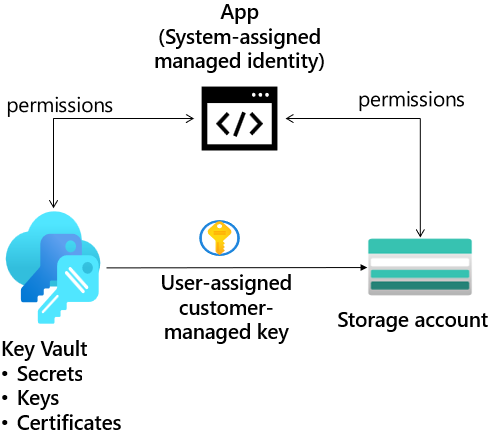

---
lab:
  title: "Exercice\_04\_: Fournir du stockage pour une nouvelle application d’entreprise"
  module: Guided Project - Azure Files and Azure Blobs
---
L’entreprise conçoit et développe une nouvelle application. Les développeurs doivent vérifier que le stockage est accessible uniquement à l’aide de clés et d’identités managées. Les développeurs souhaitent utiliser le contrôle d’accès en fonction du rôle. Pour faciliter les tests, un stockage immuable protégé est nécessaire. 

## Diagramme de l'architecture

## Tâches d'apprentissage

- Créez le compte de stockage et l’identité managée.
- Sécurisez l’accès au compte de stockage avec un coffre de clés et une clé.
- Configurez le compte de stockage de manière à utiliser une clé gérée par le client dans votre coffre de clés.
- Configurez une stratégie de rétention basée sur le temps et une étendue de chiffrement.

## Instructions de l’exercice

## Créer le compte de stockage et l’identité managée

1. Fournissez un compte de stockage pour l’application web. 
    - Dans le portail, recherchez et sélectionnez **Comptes de stockage**. 
    - Sélectionnez **+ Créer**.
    - Pour **Groupe de ressources**, sélectionnez **Créer**. Donnez un **nom** à votre groupe de ressources et sélectionnez **OK** pour enregistrer vos modifications.
    - Indiquez un **Nom de compte de stockage**. Le nom doit être unique et respecter les exigences de nommage.
    - Déplacez vers l’onglet **Chiffrement**.
    - Cochez la case **Activer le chiffrement d’infrastructure**.
    - Notez l’avertissement suivant : *Cette option ne peut pas être modifiée après la création de ce compte de stockage.*
    - Sélectionnez **Vérifier + créer**.
    - Attendez que la ressource soit déployée.

1. Fournissez une identité managée pour l’application web.  En savoir plus [sur les identités managées](https://learn.microsoft.com/azure/active-directory/managed-identities-azure-resources/overview).

    - Recherchez et sélectionnez **Identités managées**.
    - Sélectionnez **Créer**.
        - Sélectionnez votre **groupe de ressources**. 
        - Donnez un nom à votre identité managée.
    - Sélectionnez **Vérifier et créer**, puis **Créer**. 

1. Attribuez les autorisations appropriées à l’identité managée. L’identité a uniquement besoin de lire et de lister les conteneurs et objets blob. En savoir plus sur l’[attribution de rôles Azure](https://learn.microsoft.com/azure/role-based-access-control/role-assignments-portal).
    
    - Recherchez et sélectionnez votre **compte de stockage**.
    - Sélectionnez le volet **Contrôle d’accès (IAM)**.
    - En haut de la page, sélectionnez **Ajouter une attribution de rôle**.
    - Sur la page **Rôles des postes**, recherchez et sélectionnez le rôle **Lecteur de données d’objets blob de stockage**. 
    - Sur la page **Membres**, sélectionnez **Identité managée**.
    - Sélectionnez **Sélectionner des membres**, dans la liste déroulante **Identité managée**, sélectionnez **Identité managée affectée par l’utilisateur**.
    - Sélectionnez l’identité managée créée à l’étape précédente. 
    - Cliquez sur **Sélectionner**, puis sur **Vérifier + attribuer** pour vérifier et attribuer le rôle. 
    - Sélectionnez **Vérifier + attribuer** une deuxième fois pour ajouter l’attribution de rôle.
    - Votre compte de stockage est désormais accessible par une identité managée avec les autorisations Lecteur de données d’objets blob de stockage. 

## Sécuriser l’accès au compte de stockage avec un coffre de clés et une clé

1. Pour créer le coffre de clés et la clé nécessaires pour cette partie du labo, votre compte d’utilisateur doit disposer d’autorisations Administrateur Key Vault. En savoir plus sur l’[accès aux clés, certificats et secrets de Key Vault avec un contrôle d’accès en fonction du rôle Azure](https://learn.microsoft.com/azure/key-vault/general/rbac-guide?tabs=azure-cli)
    - Dans le portail, recherchez et sélectionnez **Groupes de ressources**. 
    - Sélectionnez votre **groupe de ressources**, puis le volet **Contrôle d’accès (IAM)**.
    - En haut de la page, sélectionnez **Ajouter une attribution de rôle**.
    - Sur la page **Rôles des postes**, recherchez et sélectionnez le rôle **Administrateur Key Vault**.
    - Sur la page **Membres**, sélectionnez **Utilisateur, groupe ou principal du service**.
    - Cliquez sur **Sélectionner des membres**.
    - Recherchez et sélectionnez votre compte d’utilisateur. Votre compte d’utilisateur est affiché en haut à droite du portail.
    - Cliquez sur **Sélectionner**, puis sur **Vérifier + attribuer**.
    - Sélectionnez **Vérifier + attribuer** une deuxième fois pour ajouter l’attribution de rôle.
    - Vous êtes maintenant prêt à continuer avec l’onglet.

1. Créez un coffre de clés pour stocker les clés d’accès. 

    - Dans le portail, recherchez et sélectionnez **Coffres de clés**.
    - Sélectionnez **Créer**.
    - Sélectionnez votre **groupe de ressources**.
    - Indiquez le **nom** du coffre de clés. Le nom doit être unique.
    - Vérifiez sous l’onglet **Configuration d’accès** que **Contrôle d’accès en fonction du rôle Azure (recommandé)** est sélectionné. 
    - Sélectionnez **Revoir + créer**.
    - Attendez la fin des vérifications de validation puis cliquez sur **Créer**.
    - Une fois le déploiement terminé, sélectionnez **Accéder à la ressource**.
    - Dans le panneau **Vue d’ensemble**, vérifiez que la **suppression réversible** et la **Protection de suppression définitive** sont **activées**. 

1. Créez une clé gérée par le client dans le coffre de clés. 

    - Dans votre **coffre de clés**, dans la **section Objets**, sélectionnez le panneau **Clés**.
    - Sélectionnez **Générer/Importer**, puis saisissez un **Nom** pour la clé.
    - Conservez les valeurs par défaut pour le reste des paramètres, puis cliquez sur **Créer** pour créer la clé.

## Configurez le compte de stockage de manière à utiliser une clé gérée par le client dans votre coffre de clés.

1. Avant de pouvoir effectuer les étapes suivantes, vous devez attribuer le rôle Utilisateur de chiffrement de Key Vault Crypto Service à l’identité managée. En savoir plus sur l’utilisation [d’une identité managée affectée par le système pour autoriser l’accès](https://learn.microsoft.com/azure/storage/common/customer-managed-keys-configure-existing-account?tabs=azure-portal#use-a-system-assigned-managed-identity-to-authorize-access)
    - Dans le portail, recherchez et sélectionnez **Groupes de ressources**. 
    - Sélectionnez votre **groupe de ressources**, puis le volet **Contrôle d’accès (IAM)**.
    - En haut de la page, sélectionnez **Ajouter une attribution de rôle**.
    - Sur la page **Rôles des postes**, recherchez et sélectionnez le rôle **Utilisateur de chiffrement de Key Vault Crypto Service**.
    - Sur la page **Membres**, sélectionnez **Identité managée**.
    - Sélectionnez **Sélectionner des membres**, dans la liste déroulante **Identité managée**, sélectionnez **Identité managée affectée par l’utilisateur**.
    - Sélectionnez votre identité managée.  
    - Cliquez sur **Sélectionner**, puis sur **Vérifier + attribuer**.
    - Sélectionnez **Vérifier + attribuer** une deuxième fois pour ajouter l’attribution de rôle.
    
1. Configurez le compte de stockage de manière à utiliser une clé gérée par le client dans votre coffre de clés. En savoir plus sur les [clés gérées par le client sur un compte de stockage existant](https://learn.microsoft.com/azure/storage/common/customer-managed-keys-configure-existing-account?WT.mc_id=Portal-Microsoft_Azure_Storage&tabs=azure-portal).
    - Revenez à votre compte de stockage.
    - Dans la section **Sécurité + réseau**, sélectionnez le panneau **Chiffrement**.
    - Sélectionnez **Clés gérées par le client**.
    - **Sélectionnez un coffre de clés et une clé**. Sélectionnez votre coffre de clés et une clé.
    - Utilisez **Sélectionner** pour confirmer vos choix. 
    - Vérifiez que le **Type d’identité** est défini sur **Affectée par l’utilisateur**.
    - **Sélectionner une identité**.
    - Sélectionnez votre identité managée, puis sélectionnez **Ajouter**. 
    - **Enregistrez** les changements apportés.
    - Si vous recevez une erreur indiquant que votre identité ne dispose pas des autorisations nécessaires, patientez une minute et réessayez. 

## Configurez une stratégie de rétention basée sur le temps et une étendue de chiffrement.

1. Les développeurs ont besoin d’un conteneur de stockage dans lequel les fichiers ne peuvent pas être modifiés, même par l’administrateur. En savoir plus sur le [stockage immuable d’objets blob](https://learn.microsoft.com/azure/storage/blobs/immutable-storage-overview).

    - Accédez à votre **compte de stockage**.
    - Dans la section **Stockage des données**, sélectionnez le panneau **Conteneurs**. 
    - Créez un conteneur appelé **hold**. Utilisez les valeurs par défaut. Veillez à **Créer** le conteneur. 
    - Chargez un fichier dans le conteneur. 
    - Dans la section **Paramètres**, sélectionnez le panneau **Politique d’accès**. 
    - Sous la section **Stockage d’objets blob immuables**, sélectionnez **+ Ajouter une stratégie**. 
    - Sélectionnez **Conservation basée sur le temps** comme **Type de stratégie**. 
    - Définissez la **Période de conservation** sur **5 jours**. 
    - Veillez à **Enregistrer** vos modifications. 
    - Essayez de **supprimer** le fichier dans le conteneur. 
    - Vérifiez que vous êtes informé de **l’échec de la suppression des objets blob** en raison d’une stratégie.  

1. Les développeurs ont besoin d’une étendue de chiffrement autorisant le chiffrement de l’infrastructure. En savoir plus sur le [chiffrement d’infrastructure](https://learn.microsoft.com/azure/storage/common/infrastructure-encryption-enable?tabs=portal).

    - Revenez à votre compte de stockage. 
    - Dans le panneau **Sécurité + mise en réseau**, sélectionnez **Chiffrement**.
    - Sous l’onglet **Étendues de chiffrement**, sélectionnez **Ajouter**.
    - Donnez un **nom** à votre étendue de chiffrement. 
    - Le **Type de chiffrement** est **Clé gérée par Microsoft**.
    - Définissez le **Chiffrement d’infrastructure** sur **Activer**.
    - **Créez** l’étendue de chiffrement.
    - Revenez à votre compte de stockage, puis créez un conteneur.
    - Notez que sur la page **Nouveau conteneur**, il y a le **Nom** et le **Niveau d’accès public**.
    - Notez que dans la section **Avancé**, vous pouvez sélectionner l’**Étendue de chiffrement** que vous avez créée et l’appliquer à tous les objets blob du conteneur. 

>**Remarque** : pour des exercices supplémentaires, suivez le module [Sécuriser et isoler l’accès aux ressources Azure en utilisant des groupes de sécurité réseau et des points de terminaison de service](https://learn.microsoft.com/training/modules/secure-and-isolate-with-nsg-and-service-endpoints/). Le module propose un bac à sable qui vous permet de vous familiariser davantage avec la restriction de l’accès au stockage.

## Nettoyage de vos ressources

Si vous travaillez avec **votre propre abonnement** et que vous avez terminé ces labos, prenez un moment pour supprimer les ressources du labo. Ceci garantit que les ressources sont libérées et que les coûts sont réduits. Le moyen le plus simple de supprimer les ressources du labo est de supprimer le groupe de ressources du labo. 

+ Dans le Portail Azure, sélectionnez le groupe de ressources, **Supprimer le groupe de ressources**, **Entrer le nom du groupe de ressources**, puis cliquez sur **Supprimer**.
+ `Remove-AzResourceGroup -Name resourceGroupName` en utilisant Azure PowerShell.
+ `az group delete --name resourceGroupName` en utilisant l’interface CLI.

## Développer votre apprentissage avec Copilot

Copilot peut vous aider dans votre parcours d’apprentissage. Copilot peut présenter des informations techniques de base, des étapes générales, les avantages et les inconvénients, de l’aide à la résolution des problèmes, des cas d’utilisation, des exemples de codage, etc. Pour accéder à Copilot, ouvrez un navigateur Edge et choisissez Copilot (en haut à droite). Prenez quelques minutes pour essayer ces invites.
+ Qu’est-ce qu’une identité managée Azure et comment peut-elle être utilisée avec le stockage Azure ?
+ Quels rôles intégrés de contrôle d’accès en fonction du rôle (RBAC) sont disponibles pour gérer l’accès au stockage Azure. 
+ Qu’est-ce que les clés gérées par le client et comment sont-elles utilisées pour le stockage Azure ?

## En savoir plus grâce à l’apprentissage auto-rythmé

+ [Sécuriser et isoler l’accès aux ressources Azure en utilisant des groupes de sécurité réseau et des points de terminaison de service](https://learn.microsoft.com/training/modules/secure-and-isolate-with-nsg-and-service-endpoints/). Dans ce module, vous allez découvrir comment utiliser des points de terminaison de service de réseau virtuel pour contrôler le trafic réseau en provenance et à destination des services Azure.

## Points clés
+ Azure a des rôles RBAC intégrés pour le stockage Azure. Ces rôles incluent : contributeur de compte de stockage, propriétaire des données BLOB de stockage, et contributeur de partage SMB de données de fichier.
+ Vous pouvez utiliser votre propre clé de chiffrement pour protéger les données de votre compte de stockage. Quand vous spécifiez une clé gérée par le client, cette clé est utilisée pour protéger et contrôler l’accès à la clé qui chiffre vos données. 
+ Le stockage immuable garantit que les données ne peuvent pas être modifiées ou supprimées pendant un intervalle spécifié par l’utilisateur. Il existe deux types de stratégies immuables : la conservation limitée dans le temps et la conservation légale.
+ Le chiffrement d’infrastructure peut être activé pour l’ensemble du compte de stockage ou pour une étendue de chiffrement au sein d’un compte. Le chiffrement de l’infrastructure est recommandé pour les scénarios où le chiffrement double des données est nécessaire pour les exigences de conformité. 
